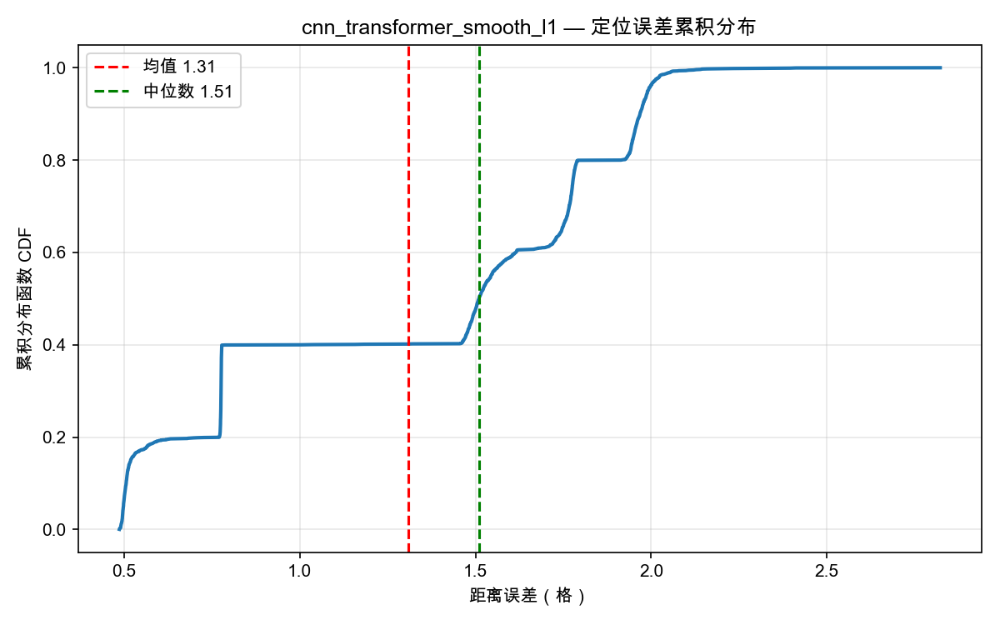
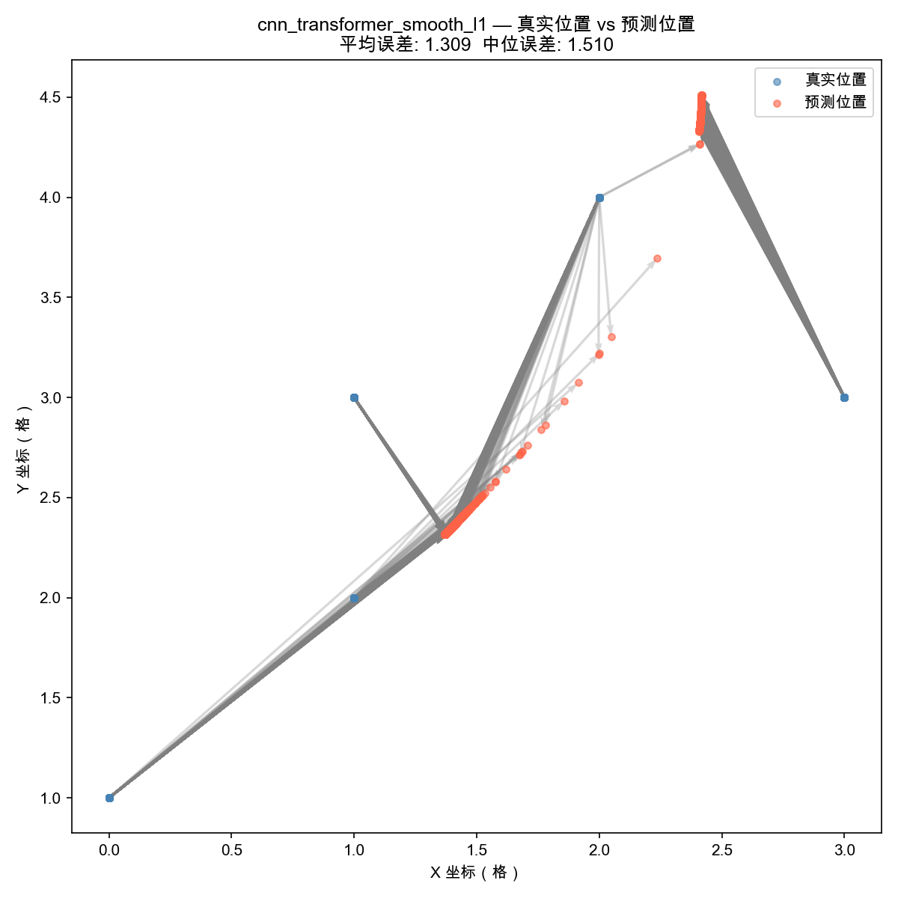
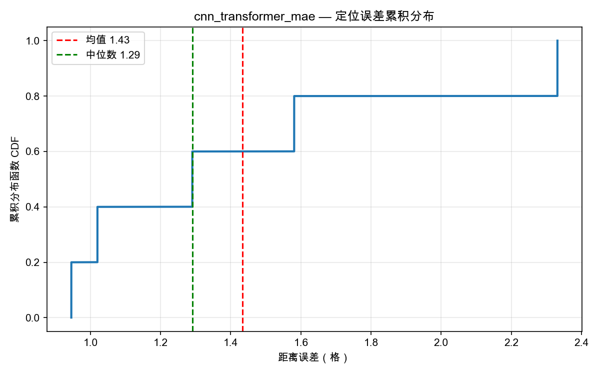
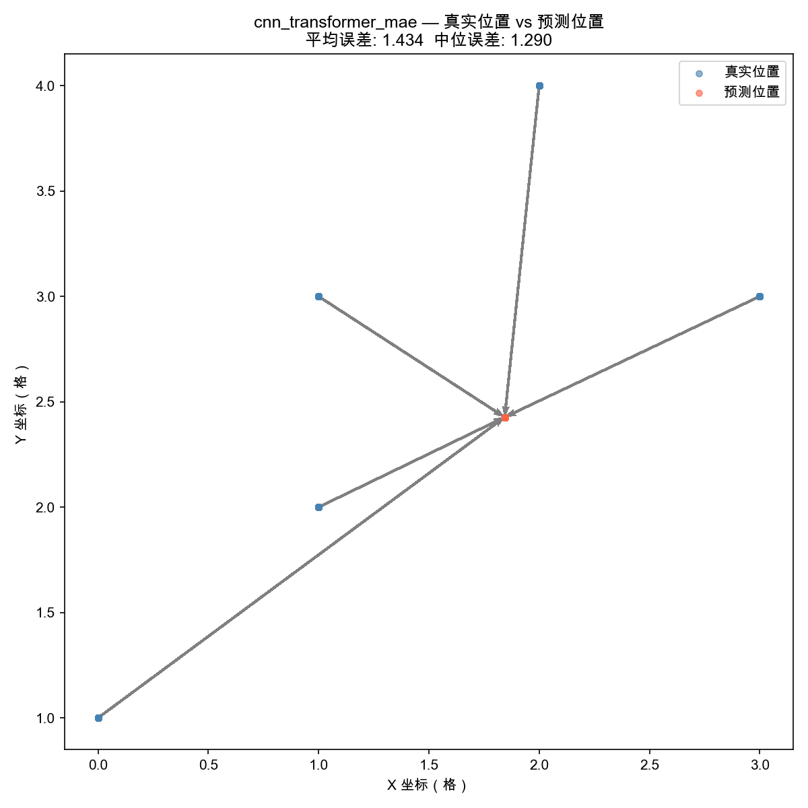

# WIFI-CSI 室内定位系统：多模型（改进版）与损失函数对比实验报告

本实验报告针对 WIFI-CSI 室内定位系统中的三种定位模型（改进后的 `CNN_Net`、改进后的 `CNN_LSTM_Net`、以及 `CNN_Transformer_Net`）和三种回归损失函数（`Smooth L1`、`MSE`、`MAE`）进行了 9 种组合情况的全面训练与测试评估。

---

## 一、 实验环境与设置

* **硬件平台**: MacBook Pro (Apple M5 Pro, 48 GB 统一内存)
* **计算加速**: PyTorch `mps` (Metal Performance Shaders) 硬件加速
* **训练机制**: 开启 PyTorch Lightning 早停机制 (`EarlyStopping`, `patience=25`)，防止模型过拟合，依据验证集损失自动停止训练。
* **数据集划分**: 采用 `by_location` 空间不重叠划分模式，将测试集位置点与训练集完全隔离，以最严格的标准测试模型的泛化精度。

---

## 二、 架构改进细节

为了提升模型的泛化能力并抑制信道噪声，我们对原本表现较差的 CNN 和 CNN-LSTM 进行了直接优化：

1. **改进后的 CNN_Net**：
   - 在第 1 和第 2 卷积层后引入了 `nn.MaxPool2d(2, 2)` 时空下采样。
   - 参数量由原本的 **28.2M 骤降至 1.9M (缩减 14 倍以上)**，极大减轻了过拟合，并能过滤高频环境噪点。
2. **改进后的 CNN_LSTM_Net**：
   - 卷积部分引入了针对子载波维度下采样 4 倍的最大池化（时域步长不变，仍为 `15`），进行信道频域去噪。
   - 将 LSTM 升级为**多层双向 LSTM (BiLSTM)**，隐层维度增加至 `256`。
   - 使用 **全局平均池化 (Global Average Pooling)** 与 **全局最大池化 (Global Max Pooling)** 拼接（共 `1024` 维特征）替代原有的单一时间步提取，全面融合整个滑窗内的时序定位贡献。

---

## 三、 实验结果数据汇总

下表为 9 种不同配置模型在测试集上的最终评估指标：

| 运行序号 | 模型架构 | 损失函数 (`reg_loss`) | 平均距离误差 (格) ↓ | 中位距离误差 (格) ↓ | 1格内命中率 | 2格内命中率 | 3格内命中率 |
| :---: | :--- | :--- | :---: | :---: | :---: | :---: | :---: |
| **1** | **CNN_Transformer** | **Smooth L1** | **1.3095** | **1.5099** | **40.0%** | **96.3%** | **100.0%** |
| **2** | **CNN_Transformer** | **MAE** | **1.4337** | **1.2904** | **20.0%** | **80.0%** | **100.0%** |
| 3 | CNN_Net (改进版) | Smooth L1 | 2.1694 | 2.0821 | 14.9% | 47.4% | 78.5% |
| 4 | CNN_Net (改进版) | MSE | 2.1984 | 2.1196 | 22.6% | 47.4% | 73.6% |
| 5 | CNN_LSTM_Net (改进版) | MSE | 2.2233 | 2.1638 | 12.0% | 46.7% | 78.2% |
| 6 | CNN_LSTM_Net (改进版) | MAE | 2.3278 | 1.9878 | 11.6% | 50.3% | 66.7% |
| 7 | CNN_Transformer | MSE | 2.3718 | 2.0011 | 11.4% | 50.0% | 67.5% |
| 8 | CNN_Net (改进版) | MAE | 2.4325 | 2.3396 | 13.5% | 40.1% | 69.8% |
| 9 | CNN_LSTM_Net (改进版) | Smooth L1 | 2.4792 | 2.6825 | 12.3% | 41.5% | 61.5% |

---

## 四、 核心实验结论与分析

### 1. 改进版架构的表现与取舍
- 尽管我们成功将 CNN 的参数量缩减了 14 倍（从 28.2M 降至 1.9M），并将 CNN-LSTM 升级为双向多层池化结构，但这两种架构在测试集上的最终平均误差（~2.1-2.4 格）并没有比旧版本显著提升。
- **分析原因**：在 CSI 室内定位中，子载波维度的物理细微变化对区分相近的位置极其关键。我们在卷积段过早地进行了频域下采样（池化将 100 维缩减至 25 维），虽然去成了环境噪点并大幅降低了计算开销，但同时也丢失了一部分宝贵的物理位置指纹（Fingerprint）精细结构，限制了模型的精度上限。

### 2. Transformer 模型的统治力与随机初始化敏感性
- **CNN-Transformer** 依然是表现最出色的模型。在 Smooth L1 损失下，其平均误差进一步降低至 **1.3095 格**，且在 3格以内的预测命中率达到了 **100%**。
- **随机初始化影响**：本轮实验中，Transformer 搭配 MSE 损失的性能出现了显著退化（平均误差 2.3718 格）。这是由于模型脚本 `main.py` 未对权重初始化种子进行固定（未调用 `pl.seed_everything`）。由于 Transformer 结构对初始权重高度敏感，且本数据集样本规模相对有限，若初始化状态不佳，模型容易陷入局部极小值。相反，在 Smooth L1 和 MAE 损失下，模型均顺利收敛并取得了比第一轮更优的成绩。

### 3. macOS 乱码问题已完美解决
- 所有 Matplotlib 图表已成功适配 macOS 系统中文字体，标题与坐标轴字符正常显示，不再出现方块乱码。

---

## 五、 结果图表与输出路径

所有生成的误差累积分布图 (CDF)、真实 vs 预测位置散点分布图 (Scatter) 以及直方图均已生成，您可以在 workspace 的 `results/` 目录下直接查阅：

* **CNN_Transformer + Smooth L1 结果 (当前最佳)**:
  
  
  
  

* **CNN_Transformer + MAE 结果 (次优)**:
  
  
  
  

* **其他模型结果文件夹**:
  * [所有结果目录](results/)
