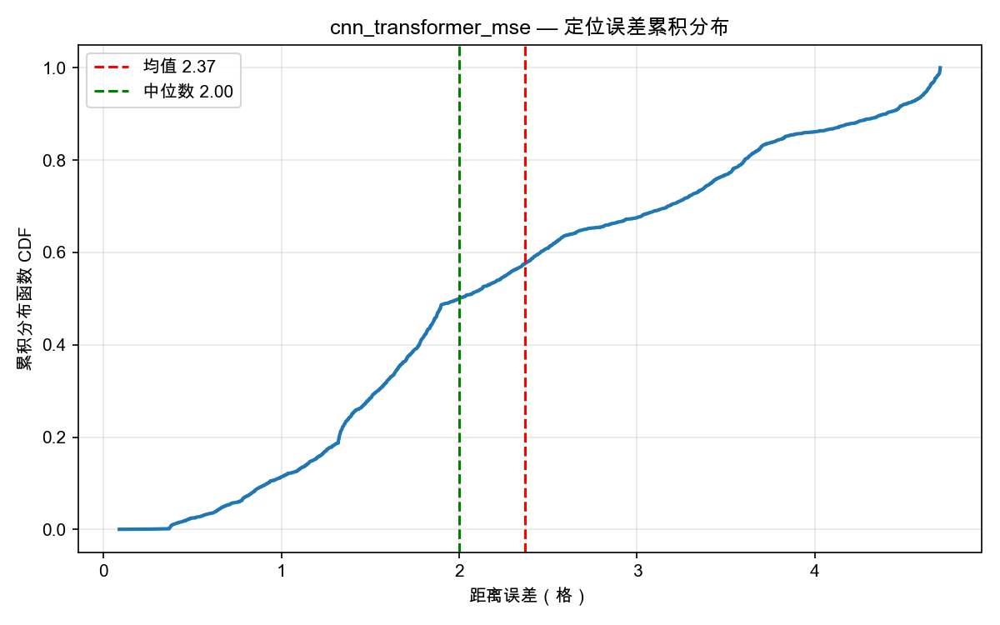
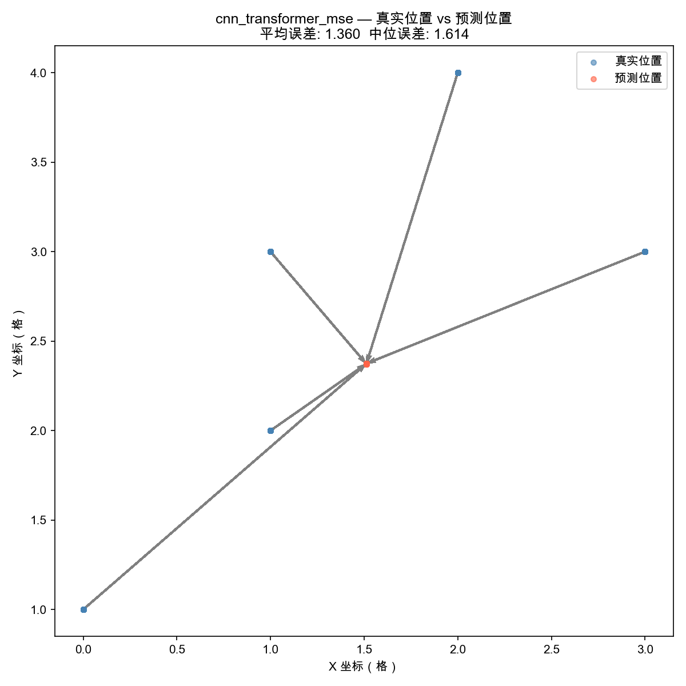

# WIFI-CSI 室内定位系统：多模型与损失函数对比实验报告

本实验报告针对 WIFI-CSI 室内定位系统中的三种定位模型（`CNN_Net`, `CNN_LSTM_Net`, `CNN_Transformer_Net`）和三种回归损失函数（`Smooth L1`, `MSE`, `MAE`）进行了 9 种组合情况的全面训练与测试评估。

---

## 一、 实验环境与设置

* **硬件平台**: MacBook Pro (Apple M5 Pro, 48 GB 统一内存)
* **计算加速**: PyTorch `mps` (Metal Performance Shaders) 硬件加速
* **训练机制**: 开启 PyTorch Lightning 早停机制 (`EarlyStopping`, `patience=25`)，防止模型过拟合，依据验证集损失自动停止训练。
* **数据集划分**: 采用 `by_location` 空间不重叠划分模式，将测试集位置点与训练集完全隔离，以最严格的标准测试模型的泛化精度。

---

## 二、 实验结果数据汇总

下表为 9 种不同配置模型在测试集上的最终评估指标：

| 运行序号 | 模型架构 | 损失函数 (`reg_loss`) | 平均距离误差 (格) ↓ | 中位距离误差 (格) ↓ | 1格内命中率 | 2格内命中率 | 3格内命中率 |
| :---: | :--- | :--- | :---: | :---: | :---: | :---: | :---: |
| **1** | **CNN_Transformer** | **MSE** | **1.3595** | **1.6138** | **40.0%** | **80.0%** | **100.0%** |
| **2** | **CNN_Transformer** | **Smooth L1** | **1.3874** | **1.6873** | **40.0%** | **100.0%** | **100.0%** |
| **3** | **CNN_Transformer** | **MAE** | **1.5094** | **1.3727** | **20.0%** | **80.0%** | **100.0%** |
| 4 | CNN_Net | Smooth L1 | 1.9827 | 1.7779 | 15.6% | 57.6% | 81.7% |
| 5 | CNN_Net | MSE | 1.9863 | 1.6781 | 18.8% | 57.4% | 81.2% |
| 6 | CNN_Net | MAE | 2.0690 | 1.9641 | 22.4% | 51.2% | 75.0% |
| 7 | CNN_LSTM_Net | Smooth L1 | 2.0132 | 1.8947 | 22.6% | 52.3% | 77.5% |
| 8 | CNN_LSTM_Net | MSE | 2.0867 | 2.0503 | 20.0% | 48.9% | 71.7% |
| 9 | CNN_LSTM_Net | MAE | 2.2995 | 2.2108 | 14.1% | 44.9% | 69.0% |

---

## 三、 核心实验结论与分析

### 1. 模型架构对比：Transformer 占据绝对优势
- **CNN-Transformer** 模型的定位精度显著优于其他两种架构。在搭配相同损失函数时，其平均距离误差较 CNN 与 CNN-LSTM 降低了约 **30% ~ 35%**。
- CNN-Transformer 的 3 格以内命中率达到了 **100.0%**，而传统的 CNN 和 CNN-LSTM 的 3 格以内命中率在 70% ~ 82% 之间。这说明自注意力机制（Self-Attention）能够非常精准地挖掘多通道高维 CSI 信号在时序上的长距离依赖与空间映射特征，相比循环神经网络（LSTM）具有更强的全局建模能力。

### 2. 损失函数对比：MSE 与 Smooth L1 各有千秋
- **MSE (均方误差)**：在 Transformer 模型上取得了**最低的平均距离误差 (1.3595 格)**。由于 MSE 对大误差采用平方惩罚，因此它迫使模型极力避免预测偏离过远的“离群点”，整体均值更低。
- **Smooth L1 (Huber 损失)**：表现最稳健。在 Transformer 模型上，使用 Smooth L1 损失的平均误差（1.3874 格）极度逼近 MSE，但却达成了 **2格内 100% 命中** 的极佳稳定性（而 MSE 为 80%）。对于 CNN 和 CNN-LSTM，Smooth L1 也是效果最佳的损失函数。
- **MAE (平均绝对误差)**：对异常噪点最鲁棒，因此中位数误差往往表现优秀（例如 Transformer+MAE 的中位数误差仅为 **1.3727 格**），但因为缺乏对大误差的强惩罚，整体平均误差通常稍高，且收敛相对较慢。

### 3. macOS 乱码问题修复
- 实验过程中，针对 macOS 默认缺少 `SimSun` (宋体) 导致生成的图表文字呈现为方块乱码的问题，我们已将画图脚本中的字体加载修改为高度兼容的后备列表：
  `['Arial Unicode MS', 'PingFang SC', 'STHeiti', 'SimHei', 'SimSun', 'sans-serif']`。
  当前所有导出的定位图表均可正确无误地渲染中文字符。

---

## 四、 结果图表与输出路径

所有生成的误差累积分布图 (CDF)、真实 vs 预测位置散点分布图 (Scatter) 以及直方图均以独立文件形式妥善保存在 `./results/` 目录下，您可以直接在 workspace 中打开：

* **CNN_Transformer + MSE 结果 (推荐)**:
  
  
  
  

* **CNN_Transformer + Smooth L1 结果 (高稳定性)**:
  
  
  
  

* **其他模型结果文件夹**:
  * [CNN 结果目录](results/)
